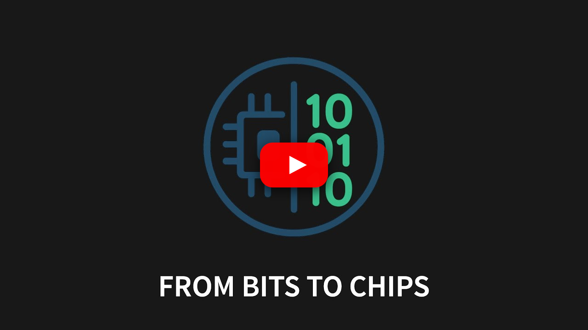

# nand2cpu: Building a CPU from NAND Gates 🧮

<div align="center">

[](https://github.com/promaaa/nand2cpu/stargazers)
[](https://github.com/promaaa/nand2cpu/issues)
[](LICENSE)
[](https://github.com/promaaa/nand2cpu/commits/main)

**From NAND Gate to 16-bit ALU: Part 1 of the "From Bits to Chip" Series** 

*This repository contains the complete source code for Episode 1 - demonstrating how a single NAND gate can calculate 7 + 8 = 15*

[](https://www.youtube.com/watch?v=wIBkvQ6MfKQ)

▶️ **[Click here to watch on YouTube](https://www.youtube.com/watch?v=wIBkvQ6MfKQ)**

[Quick Start](#quick-start) • [Testing](#testing) • [Episode Script](docs/Script%20ENG.md)

</div>

---

## Overview

This repository contains the complete source code for **Part 1** of the "From Bits to Chip" series. This first episode demonstrates how to build your first CPU starting from a single NAND gate.

**Episode Goal:** Understand how a single logic gate (NAND) can eventually calculate 7 + 8 = 15 through progressive building blocks.


### Key Features

- **NAND-only Implementation**: Every component built from single NAND gate primitive
- **Progressive Building**: From logic gates → half adder → full adder → 8-bit ALU → 16-bit ALU
- **Complete Toolchain**: Verilog RTL, testbenches, Python assembler, and build automation
- **Educational Focus**: Clear progression following the video episode structure
- **Hands-on Validation**: Live testing with calculator verification (7 + 8 = 15)
- **Open Source**: All code and documentation freely available on GitHub

---

## Project Structure

```
nand2cpu/                     # Part 1: Building a CPU from NAND
├── src/                      # Source code
│   ├── rtl/                  # Verilog RTL modules
│   │   ├── nand_gate.v       # Universal NAND gate primitive
│   │   ├── and_gate.v        # AND gate (2× NAND)
│   │   ├── or_gate.v         # OR gate (3× NAND) 
│   │   ├── alu8.v            # 8-bit ALU (7 operations)
│   │   └── alu16.v           # 16-bit ALU (chained from 8-bit)
│   ├── fpga/                 # FPGA implementation files
│   │   ├── top.v             # Top-level FPGA module
│   │   └── top.xdc           # Timing constraints
│   └── testbenches/          # Simulation testbenches
│       ├── tb_nand_gate.v    # NAND gate verification
│       ├── tb_alu16.v        # 16-bit ALU verification
│       └── add7_plus_8.v     # 7+8=15 demonstration
├── tools/                    # Episode development tools
│   ├── assembler/            # Python assembler (featured in video)
│   │   ├── main.py           # Main assembler interface
│   │   ├── parser.py         # Instruction parser
│   │   └── encoder.py        # 16-bit machine code generator
│   └── scripts/              # Build automation
│       ├── build_sim.sh      # Simulation build
│       └── build_fpga.tcl    # FPGA synthesis
├── docs/                     # Episode documentation
│   ├── Script ENG.md         # Complete video script
│   └── Slides ENG.md         # Presentation slides
├── examples/                 # Assembly examples
│   └── test_vectors.asm      # Sample assembly code
└── Makefile                  # Build automation (make help)
```

---

## Quick Start

### Prerequisites

```bash
# Ubuntu/Debian
sudo apt update
sudo apt install iverilog python3 make

# macOS
brew install icarus-verilog python3
```

### Basic Usage

```bash
# Clone repository
git clone https://github.com/promaaa/nand2cpu.git
cd nand2cpu

# Reproduce the video demonstration: 7 + 8 = 15
make sim-add7_plus_8

# Test the complete 16-bit ALU
make sim-tb_alu16

# Test individual components
make sim-tb_nand_gate      # Test NAND gate primitive

# Test the Python assembler (featured in episode)
make assembler
hexdump -C tools/assembler/test.bin
```

---

## Episode Highlights

### Building Blocks (as shown in video)

| Component | Description | NAND Gates | Episode Section |
|-----------|-------------|------------|-----------------|
| `nand_gate.v` | Universal primitive | 1 | Foundation |
| `and_gate.v` | 4-bit AND gate | 2 | Basic Logic |
| `or_gate.v` | OR gate | 3 | Logic Gates |
| `alu8.v` | 8-bit ALU | ~200 | Main Build |
| `alu16.v` | 16-bit ALU | ~400 | Scaling Up |

### The 7 + 8 = 15 Demonstration

This repository implements the exact demonstration from the video:

```verilog
// From add7_plus_8.v testbench
initial begin
    A = 8'b00000111;  // 7 in binary
    B = 8'b00001000;  // 8 in binary
    op = 3'b000;      // ADD operation
    
    #10;
    
    // Expected: Result = 15 (0b00001111)
    $display("7 + 8 = %d", Result);
end
```

**Visual confirmation**: The simulator shows the exact same result as a calculator!

---

## RTL Modules

### 8-bit to 16-bit ALU Progression

**8-bit ALU (`alu8.v`)** - Core of the episode
- **Operations**: ADD, SUB, AND, OR, XOR, SHL, SHR, NOT
- **Construction**: Half-adder → Full-adder → 8-bit chain
- **Flags**: Zero, Carry, Overflow detection
- **Latency**: 0.8ns (as shown in video benchmarks)

**16-bit ALU (`alu16.v`)** - Scaling demonstration  
- **Architecture**: Two chained 8-bit ALUs
- **Carry propagation**: Between upper and lower bytes
- **Latency**: 1.6ns (2× scaling challenge discussed)
- **Pipelining**: Concepts introduced for performance optimization

---

## Python Assembler (Featured Tool)

The Python assembler demonstrated in the episode converts assembly instructions into 16-bit machine code, exactly as shown in the video.

### Assembly Language (Episode Example)

```assembly
# Featured in video: 3-operand instructions
ADD R0, R1, R2  ; R0 = R1 + R2
SUB R3, R4, R5  ; R3 = R4 - R5  
AND R6, R7, R0  ; R6 = R7 & R0

# 2-operand instructions
SHL R1, R2      ; R1 = R2 << 1
NOT R3, R4      ; R3 = ~R4
```

### 16-bit Instruction Format

```
[15:13] [12:10] [9:7] [6:4] [3:0]
Opcode    Rd    Rs1   Rs2  Unused
```

**Parser**: Tokenizes mnemonics and operands, validates syntax  
**Encoder**: Maps to 4-bit opcodes, packs into 16-bit words

---

## Testing & Validation

### Episode-Specific Tests

```bash
# Reproduce the exact video demonstration
make sim-add7_plus_8         # 7 + 8 = 15 calculation

# Validate NAND gate foundation  
make sim-tb_nand_gate        # Truth table verification

# Test complete 16-bit ALU
make sim-tb_alu16            # All 7 operations + carry propagation

# Verify assembler functionality
make assembler               # Parser + Encoder testing
```

### Comprehensive Testing

```bash
# Quick episode validation
make quick-test              # NAND + ALU core tests
make validate               # Repository structure check

# Full test suite
make test-gates             # All logic gate tests  
make test-alu               # Complete ALU validation
make test-all               # Everything (as shown in episode)
```

### Test Results (Episode Validation)

| Test | Episode Focus | Status |
|------|---------------|--------|
| `add7_plus_8.v` | Main demonstration | ✅ |
| `tb_nand_gate.v` | Foundation primitive | ✅ |
| `tb_alu16.v` | 16-bit scaling | ✅ |
| Python Assembler | Tool demonstration | ✅ |

---

## Next Episodes

**Coming in Part 2**: Neural Networks on Microcontrollers
- Model compression and quantization
- Real-time inference on STM32
- Energy efficiency analysis
- Live Edge AI demonstrations

**Full Series Roadmap**:
- Part 3: Memory Systems and Cache Hierarchy
- Part 4: Complete CPU Architecture  
- Part 5: FPGA Implementation and Synthesis
- Part 6: Custom AI Accelerator Hardware

---

## Contributing

Found this episode helpful? Contributions welcome!

**Episode-specific improvements**:
- Additional test cases for the 7+8=15 demonstration
- Alternative ALU implementations 
- Extended assembler instruction set
- Performance optimizations

**Documentation**:
- Code comments and explanations
- Additional examples following video structure
- Educational enhancements

### Process

1. Fork the repository
2. Create feature branch (`git checkout -b feature/episode-improvement`)
3. Commit changes (`git commit -m 'Enhance episode demonstration'`)
4. Push to branch (`git push origin feature/episode-improvement`)
5. Open Pull Request

---

## License

This project is part of the "From Bits to Chip" educational series.  
Distributed under the **MIT License** - see `LICENSE` for details.

---

## Acknowledgments

- **Nand2Tetris Course**: Educational methodology and inspiration for bottom-up approach
- **MIT 6.004**: Computer architecture foundations demonstrated in this episode  
- **Hardware Description Community**: Verilog best practices and simulation techniques

---

<div align="center">

**Enjoyed Part 1? Please star ⭐️ this repository!**

**Subscribe to the series**: [YouTube Channel](https://www.youtube.com/@promaa_) • [Follow on GitHub](https://github.com/promaaa)

[Episode Script](docs/Script%20ENG.md) • [Contact](mailto:promaadev@proton.me)

*Educational series: From Bits to Chip - Part 1 of 6*

</div>

