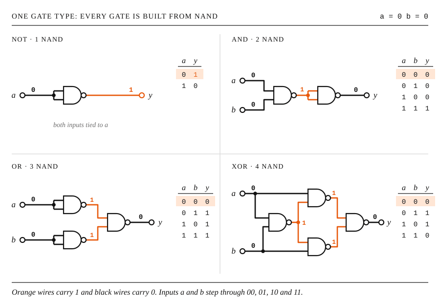

<div align="center">

# NAND2CPU

**A 16-bit CPU core wired from 2,288 NAND gates and 152 flip-flops, in Verilog.<br/>It grew from the ALU built in the first episode of the From Bits to Chips video series.**

[](LICENSE)
[](#quick-start)
[](#python-assembler)
[](https://www.youtube.com/watch?v=wIBkvQ6MfKQ)

<a href="https://www.youtube.com/watch?v=wIBkvQ6MfKQ"></a>

<sub>Click on the image to watch the episode on YouTube</sub>

</div>

## Highlights

- **NAND gates and flip-flops only.** Every logic block connects instances of [`nand_gate.v`](src/rtl/nand_gate.v), `y = ~(a & b)`, and [`dff.v`](src/rtl/dff.v) is the only state element. Yosys finds no other logic in the core.
- **A real instruction set.** 16 instructions: eight ALU operations, load immediate, load, store, output, two branches, jump and halt. Eight 16-bit registers, one instruction per clock.
- **Programs to run.** [`programs/`](programs/) has Fibonacci, shift-and-add multiplication, a RAM test and the 7 + 8 = 15 demo from the video. The Python assembler resolves labels.
- **Tested from gates to programs.** The 8-bit ALU is checked on all 1,048,576 inputs. Each program must print the values in its `; out:` comment and reach HALT, while the testbench stalls the CPU on random cycles.

## How it works



1. One NAND with its inputs tied is a NOT. Two NANDs make an AND, three an OR, four an XOR or a 2:1 multiplexer.
2. An XOR and an AND make a half adder. Two half adders and an OR make a full adder. Full adders and a tree of multiplexers make the 8-bit ALU, and two of those make the 16-bit ALU.
3. A flip-flop and a 2:1 multiplexer make a register bit that loads a new value or keeps its old one. Eight 16-bit registers, a write decoder and two 8:1 multiplexers make the register file.
4. The core connects the register file, the ALU, a decoder and a program counter, which counts with a chain of half adders.
5. A 256-word ROM holds the program and a 256-word RAM holds data. These two memories are behavioural Verilog arrays, like the built-in ROM and RAM chips of Nand2Tetris.


## Instruction set

| Opcode | Syntax | Effect |
|:-:|---|---|
| `0000` | `ADD rd, rs1, rs2` | rd = rs1 + rs2 |
| `0001` | `SUB rd, rs1, rs2` | rd = rs1 − rs2 |
| `0010` | `AND rd, rs1, rs2` | rd = rs1 & rs2 |
| `0011` | `OR rd, rs1, rs2` | rd = rs1 \| rs2 |
| `0100` | `XOR rd, rs1, rs2` | rd = rs1 ^ rs2 |
| `0101` | `SHL rd, rs1` | rd = rs1 << 1 |
| `0110` | `SHR rd, rs1` | rd = rs1 >> 1 |
| `0111` | `NOT rd, rs1` | rd = ~rs1 |
| `1000` | `LDI rd, imm` | rd = imm, from −256 to 255 |
| `1001` | `LD rd, [rs1]` | rd = RAM[rs1] |
| `1010` | `ST rs, [rs1]` | RAM[rs1] = rs |
| `1011` | `OUT rs` | output register = rs |
| `1100` | `BZ rs, label` | jump to label if rs = 0 |
| `1101` | `BNZ rs, label` | jump to label if rs ≠ 0 |
| `1110` | `JMP label` | jump to label |
| `1111` | `HALT` | stop |


The ALU opcodes are the ALU `Op` with a 0 in front, so the decoder sends `op[2:0]` straight to the ALU. `LD`, `ST` and `OUT` use the register format. The register format is the 4-bit opcode layout from the video slides.

## Programs

```asm
; The Fibonacci numbers that fit in 16 bits
    LDI R1, 0        ; a = F(0)
    LDI R2, 1        ; b = F(1)
    LDI R3, 24       ; numbers left to print
    LDI R4, -1
loop:
    ADD R5, R1, R2   ; next = a + b
    OR  R1, R2, R2   ; a = b
    OR  R2, R5, R5   ; b = next
    OUT R1
    ADD R3, R3, R4   ; count down
    BNZ R3, loop
    HALT
```

```
$ make run-fibonacci
out: 1 1 2 3 5 8 13 21 34 55 89 144 233 377 610 987 1597 2584 4181 6765 10946 17711 28657 46368
HALT after 148 instructions
```

| Program | What it does | Output | Instructions |
|---|---|--:|--:|
| [`add7_plus_8.asm`](programs/add7_plus_8.asm) | The 7 + 8 demo from the video | 15 | 4 |
| [`multiply.asm`](programs/multiply.asm) | 123 × 45 by shift and add | 5535 | 46 |
| [`fibonacci.asm`](programs/fibonacci.asm) | The Fibonacci numbers up to 46368 | 24 numbers | 148 |
| [`memory.asm`](programs/memory.asm) | Stores ten odd numbers in RAM, reads them back and adds them | 100 | 108 |

To add a program, put a `.asm` file in `programs/` with its expected output in a `; out:` comment. `make test` then runs it and checks it.

## Gate count and delay

| Block | Built from | NAND gates | Flip-flops | Longest path (NAND levels) |
|---|---|--:|--:|--:|
| NOT | one NAND, inputs tied | 1 | | 1 |
| AND | NAND, then NOT | 2 | | 2 |
| OR | NOT a, NOT b, then NAND | 3 | | 2 |
| XOR | four NANDs | 4 | | 3 |
| 2:1 multiplexer | NOT and three NANDs | 4 | | 3 |
| Half adder | XOR and AND | 6 | | 3 |
| Full adder | two half adders and OR | 15 | | 7 |
| 8-bit ALU | adder, logic, six multiplexers | 408 | | 45 |
| 16-bit ALU | two 8-bit ALUs, three multiplexers | 830 | | 93 |
| 16-bit register | a multiplexer and a flip-flop per bit | 49 | 16 | 3 |
| Register file | eight registers, write decoder, two 8:1 multiplexers | 1,129 | 128 | 10 |
| **CPU core** | register file, ALU, decoder, PC, write-back | **2,288** | **152** | **99** |

The longest path in the core starts at the opcode, goes through the register file and the 16-bit carry chain, and ends at a register input. The carry ripples through every full adder, so it is the largest part of the delay. The video uses this delay to introduce carry look-ahead and pipelining. The core count leaves out the 36 gates that compute the ALU carry out, because the core does not use it.

<details>
<summary><b>Measure it yourself</b> with Yosys</summary>

```bash
yosys -p "read_verilog src/rtl/*.v; hierarchy -top cpu; proc; flatten; techmap; opt_clean; stat; ltp -noff"
```

Replace `cpu` with any module name. Yosys maps each NAND to one `$_AND_` and one `$_NOT_` cell, and each flip-flop to a `$_DFF_P_` cell. These are the only logic cells in the report, and the `$scopeinfo` cells only record the module hierarchy. The number of `$_AND_` cells is the NAND count. Divide the longest-path length by two to get NAND levels.

</details>

## The ALU

![The 8-bit ALU: B and Cin go through XOR gates controlled by Op[0] into a chain of eight full adders, then a second XOR gives the borrow. AND, OR, XOR and NOT blocks and the two shift wirings feed a tree of six 2:1 multiplexers driven by Op[0], Op[1] and Op[2], which outputs Cout and Y](docs/Images/alu8.svg)

| `Op` | Name | `Y` | `Cout` |
|:-:|---|---|---|
| `000` | ADD | A + B + Cin | carry |
| `001` | SUB | A − B − Cin | borrow |
| `010` | AND | A & B | 0 |
| `011` | OR | A \| B | 0 |
| `100` | XOR | A ^ B | 0 |
| `101` | SHL | A << 1, Cin enters bit 0 | old top bit |
| `110` | SHR | A >> 1, Cin enters the top bit | old bit 0 |
| `111` | NOT | ~A | 0 |

For SUB, `Op[0]` inverts B and the carry with XOR gates, because A − B = A + ~B + 1. [`alu8`](src/rtl/alu8.v) and [`alu16`](src/rtl/alu16.v) have the same ports. The core sets `Cin` to 0.

## Quick start

Requirements: [Icarus Verilog](https://steveicarus.github.io/iverilog/), Python 3 and make.

```bash
sudo apt install iverilog python3 make    # Debian, Ubuntu
sudo pacman -S iverilog python make       # Arch
brew install icarus-verilog python3       # macOS
```

```bash
git clone https://github.com/promaaa/nand2cpu.git && cd nand2cpu
make test
make run-fibonacci
```

`make test` runs every testbench and every program, and compiles the FPGA top level. It takes about 30 seconds, mostly for the exhaustive 8-bit ALU test. The main lines of the output are:

```
PASS : all 1048576 combinations of A, B, Op and Cin
PASS : 101296 boundary and random cases
PASS : Y=15, Cout=0
PASS : add7_plus_8
PASS : fibonacci
PASS : memory
PASS : multiply
All tests passed.
```

`make sim-<name>` runs one testbench, for example `make sim-add7_plus_8` for the ALU demo from the video. The gate testbenches and the demo write waveforms to `build/sim/*.vcd`, which [GTKWave](https://gtkwave.sourceforge.net/) opens.

## Python assembler

`make run-<program>` assembles the program before it runs it. To use the assembler alone:

```bash
python3 tools/assembler/main.py programs/multiply.asm build/multiply.bin
```

It writes `build/multiply.bin` and `build/multiply.bin.hex`, one 16-bit word per line, which `$readmemh` loads into the ROM. Labels go on their own line and comments start with `;`. Immediates can be decimal, negative or hexadecimal (`0x1F`). An unknown instruction, a bad register, an out-of-range number or an unknown label stops the assembler with the file and line number.

## FPGA

[`src/fpga/top.v`](src/fpga/top.v) runs a program on a PYNQ-Z1 board (Zynq XC7Z020) at 8 instructions per second, so that you can follow it on the four LEDs. The LEDs show the low 4 bits of the output register. `make fpga PROGRAM=fibonacci` builds the bitstream with Vivado. This build has not been tested on a board yet.

## Limits

- Branches only test a register for zero. There is no carry or sign flag, so a comparison such as a < b needs extra instructions.
- Addresses are 8 bits, so a program has at most 256 instructions and 256 words of data.
- The core runs one instruction per clock and has no pipeline.

## Repository

| Path | Contents |
|---|---|
| [`src/rtl/`](src/rtl/) | The NAND gate, the flip-flop and every module built from them, up to [`cpu.v`](src/rtl/cpu.v) and [`computer.v`](src/rtl/computer.v) |
| [`programs/`](programs/) | Example programs with their expected output |
| [`src/testbenches/`](src/testbenches/) | Self-checking testbenches, and [`tb_computer.v`](src/testbenches/tb_computer.v), which runs the programs |
| [`src/fpga/`](src/fpga/) | PYNQ-Z1 top level and pin constraints |
| [`tools/assembler/`](tools/assembler/) | Python assembler: parser and encoder |
| [`tools/scripts/`](tools/scripts/) | Vivado build script |
| [`docs/`](docs/) | [Video script](docs/Script%20ENG.md), [slides](docs/Slides%20ENG.md) and images |

## License

MIT, see [LICENSE](LICENSE). The bottom-up approach follows [Nand2Tetris](https://www.nand2tetris.org/) and MIT 6.004.
